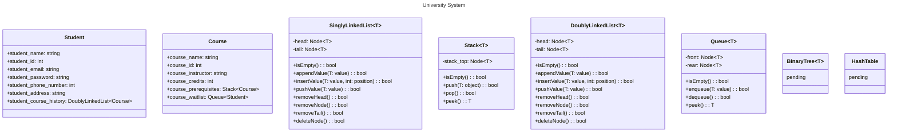

# Project Code Standards
## Module Header
Each Module should have a header that contains:
1. The name of the module.
2. What the module does.
3. Module functions overview.
4. The date of creation.
5. The author of the module.
## Naming Conventions
1. Local Variables: Snake case or Flat case (i.e. `variable_name`, `variablename`)
2. Global Variables: Pascal snake case (i.e. `Global_Variable`)
3. Constants: Capital letters only (i.e. `CONSTANT`)
4. Functions: Camel case (i.e. `functionName`)
5. Classes: Pascal case (i.e. `ClassName`)
*Avoid including digits as much as possible.*
## Code Format
1. Indentation size: 2 space.
2. Braces: Open brace on the same line as the control statement.
# Project Requirements
- Singly Linked List to store students.
- Stack to store course prerequisites.
- Doubly Linked List to track students' course history.
- Queue to be used as a wait-list for courses.
- Binary Tree to store courses.
- Hash table for searching.
# Project Class Diagram

# Functionalities
## Singly Linked List
**To-Do**:
- [ ] Inserting Nodes
	- [ ] At the start
	- [ ] At the end
	- [ ] At a specific position
- [ ] Deleting Nodes

The Singly Linked will be used to store students and should:
1. Add students with their ID, Name, Email, Phone Number, Address, and Password.
2. Remove students by their ID.
3. Display student details.
## Stack
**To-Do**:
- [ ] Push
- [ ] Pop
- [ ] Peek

The Stack will be used to store course prerequisites and should:
1. Check if a student is able to register a course by checking if their prerequisites stack is empty.
2. If the student is not able to register a course, the prerequisites left should be displayed.
## Doubly Linked List
**To-Do**:
- [ ] Inserting Nodes
	- [ ] At the start
	- [ ] At the end
	- [ ] At a specific position
- [ ] Deleting Nodes

The Doubly Linked List will be used to store each student's course enrollment history and should:
1. Add new completed courses.
2. Display the enrollment history of a specific student.
## Queue
**To-Do**:
- [ ] Enqueue
- [ ] Dequeue
- [ ] Peek

The Queue will manage each course's wait-list and should:
1. Add a student to the wait-list when a course is full.
2. Enroll the first student on the wait-list when a spot is free.
## Binary Tree
## Hash Table
**To-Do**:
- [ ] Insert
- [ ] Delete
- [ ] Get
- [ ] Update

The Hash Table will be used for efficient lookup.
