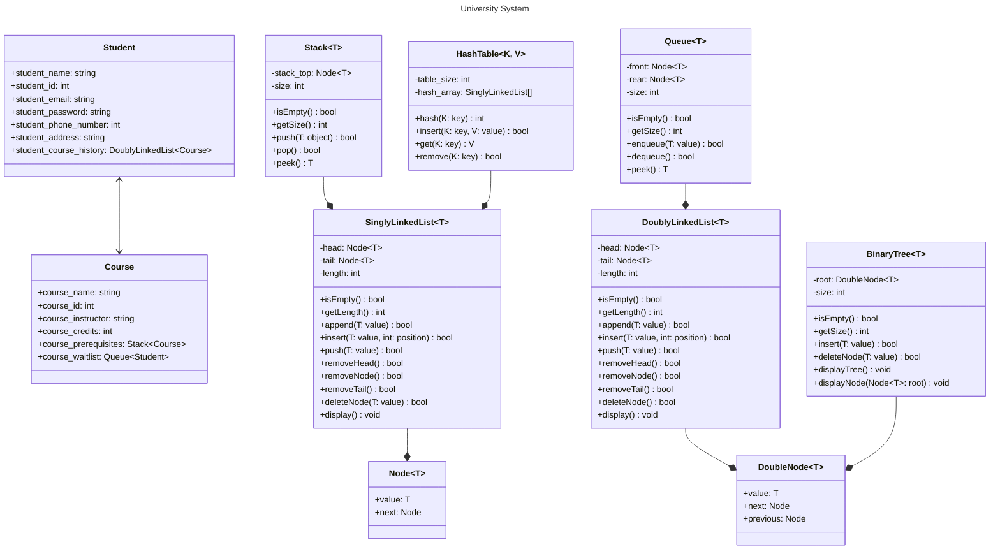

# Project Code Standards
## Module Header
Each Module should have a header that contains:
1. The name of the module.
2. What the module does.
3. Module functions overview.
4. The date of creation.
5. The author of the module.
## Naming Conventions
1. Local Variables: Snake case or Flat case (i.e. `variable_name`, `variablename`)
2. Global Variables: Pascal snake case (i.e. `Global_Variable`)
3. Constants: Capital letters only (i.e. `CONSTANT`)
4. Functions: Camel case (i.e. `functionName`)
5. Classes: Pascal case (i.e. `ClassName`)

*Avoid including digits as much as possible.*
## Code Format
1. Indentation size: 2 space.
2. Braces: Open brace on the same line as the control statement.
# Project Requirements
- Singly Linked List to store students.
- Stack to store course prerequisites.
- Doubly Linked List to track students' course history.
- Queue to be used as a wait-list for courses.
- Binary Tree to store courses.
- Hash table for searching.
# Project Class Diagram

# Modules
## Singly Linked List
### To-Do
- [x] `isEmpty()` to check if the list is empty.
- [x] Inserting
	- [x] `push()` to insert at the start.
	- [x] `append()` to insert at the end.
	- [x] `insert(T value, int position)` to insert at a specific position.
- [x] Deleting
	- [x] `removeHead()` to remove the list's head.
	- [x] `removeTail()` to remove the list's tail.
	- [x] `deleteNode(T value)` to remove a specific value.
- [x] `display()` to display the values in the list.

The Singly Linked will be used to store students and should:
1. Add students with their ID, Name, Email, Phone Number, Address, and Password.
2. Remove students by their ID.
3. Display student details.
## Stack
### To-Do
- [x] `isEmpty()` to check if the stack is empty.
- [x] `push()` to add elements to the top of the stack.
- [x] `pop()` to remove the top element in the stack.
- [x] `peek()` to return the top element in the stack.

The Stack will be used to store course prerequisites and should:
1. Check if a student is able to register a course by checking if their prerequisites stack is empty.
2. If the student is not able to register a course, the prerequisites left should be displayed.
The Stack is implemented using the Singly Linked List.
## Doubly Linked List
### To-Do
- [x] `isEmpty()` to check if the list is empty.
- [x] Inserting
	- [x] `push()` to insert at the start.
	- [x] `append()` to insert at the end.
	- [x] `insert(T value, int position)` to insert at a specific position.
- [x] Deleting
	- [x] `removeHead()` to remove the list's head.
	- [x] `removeTail()` to remove the list's tail.
	- [x] `removeNode()` to remove a specific node
	- [x] `deleteNode(T value)` to remove a specific value.
- [x] `display()` to display the values in the list.

The Doubly Linked List will be used to store each student's course enrollment history and should:
1. Add new completed courses.
2. Display the enrollment history of a specific student.
## Queue
### To-Do
- [x] `enqueue(T value)` to add elements to the end of the Queue.
- [x] `dequeue()` to remove the first element in the Queue.
- [x] `peek()` to return the first element in the Queue.

The Queue will manage each course's wait-list and should:
1. Add a student to the wait-list when a course is full.
2. Enroll the first student on the wait-list when a spot is free.
The Queue is implemented using a Doubly Linked List.
## Binary Tree
### To-Do
- [x] `isEmpty()` to check if the tree is empty.
- [x] `insert(T value)` to add elements to their appropriate location in the tree.
- [x] `deleteNode(T value)` to remove elements from the tree.
- [x] `traverse(Node<T> root)` to traverse the tree.
- [x] `display()` to print all values in the tree.

The Binary Tree will be used to store courses and should:
1. Add courses.
2. Drop courses.
## Hash Table
### To-Do
- [x] `hash(K key)` to compute the pair index.
- [x] `insert(K key, V value)` to insert a pair to the table.
- [x] `get(K key)` to retrieve the value at a key index.
- [x] `remove(K key)` to remove the key-value pair.

The Hash Table will be used for efficient lookup.
